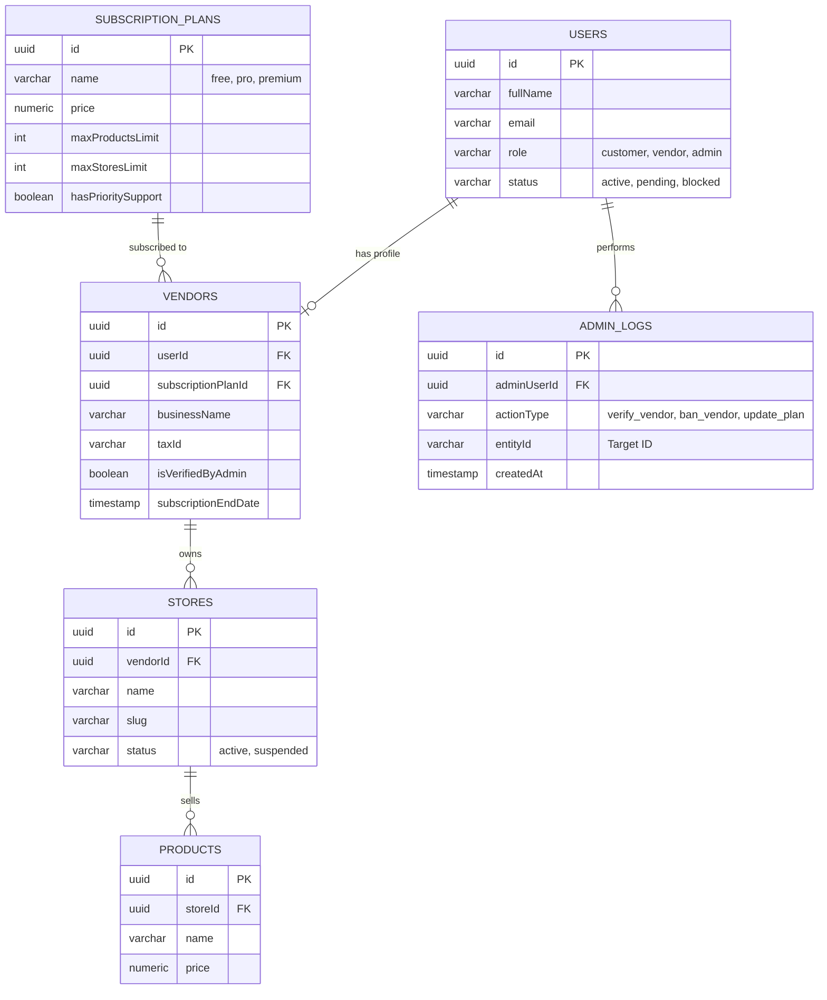

# Database Schema Recommendation for PsarPulse Vendors & Admins

Based on the existing technology stack (PostgreSQL + Drizzle ORM), here is a recommended database schema to fulfill the requirements of having a marketplace with Vendor plans (Free, Pro, Premium) and Admin functionalities. 

Since the current `users` schema seems to have roles tailored for an e-learning platform (`student`, `teacher`, `admin`), we recommend updating the roles to fit a marketplace model (`customer`, `vendor`, `admin`).

## 1. Entity Relationship Diagram (ERD)

Here is a visual representation of how the new tables interrelate.



## 2. Drizzle ORM Schema Implementation

Here is the proposed Drizzle ORM schema structure based on Postgres. You can place these in a new file, for example `lib/db/schema/marketplace.schema.ts`, and update your existing `users` table.

### 2.1 Update to [users.schema.ts](file:///c:/Users/CKP2/OneDrive/Desktop/project3/PsarPulse/lib/db/schema/users.schema.ts)

Update the roles in your existing `users` table to reflect the marketplace ecosystem instead of the previous student/teacher roles.

```typescript
import { pgTable, uuid, varchar, text, timestamp, boolean } from "drizzle-orm/pg-core";
import { relations } from "drizzle-orm";

// Updated Users Table
export const users = pgTable("users", {
  id: uuid("id").primaryKey().defaultRandom(),
  fullName: varchar("full_name", { length: 255 }).notNull(),
  email: varchar("email", { length: 255 }).notNull().unique(),
  passwordHash: varchar("password_hash", { length: 255 }).notNull(),
  // Updated roles
  role: varchar("role", { length: 50 }).$type<"customer" | "vendor" | "admin">().default("customer").notNull(),
  status: varchar("status", { length: 50 }).$type<"active" | "pending" | "blocked" | "deleted">().default("pending").notNull(),
  isVerified: boolean("is_verified").default(false).notNull(),
  createdAt: timestamp("created_at").defaultNow().notNull(),
  updatedAt: timestamp("updated_at").defaultNow().notNull(),
});
```

### 2.2 New `vendors.schema.ts` (Vendor & Subscription Entities)

This file will contain the details specific to vendors and the available plans (Free, Pro, Premium).

```typescript
import { pgTable, uuid, varchar, text, timestamp, boolean, doublePrecision, integer } from "drizzle-orm/pg-core";
import { relations } from "drizzle-orm";
import { users } from "./users.schema"; // Ensure accurate import path

// Subscription Plans (Free, Pro, Premium)
export const subscriptionPlans = pgTable("subscription_plans", {
  id: uuid("id").primaryKey().defaultRandom(),
  name: varchar("name", { length: 50 }).$type<"free" | "pro" | "premium">().notNull().unique(),
  price: doublePrecision("price").notNull(),
  billingCycle: varchar("billing_cycle", { length: 20 }).$type<"monthly" | "yearly">().default("monthly").notNull(),
  // Feature Limits mapped to plans
  maxProductsWarningLimit: integer("max_products_limit").notNull().default(50), 
  maxStoresLimit: integer("max_stores_limit").notNull().default(1),
  hasPrioritySupport: boolean("has_priority_support").default(false).notNull(),
  createdAt: timestamp("created_at").defaultNow().notNull(),
  updatedAt: timestamp("updated_at").defaultNow().notNull(),
});

// Vendor Profiles referencing Users and Plans
export const vendors = pgTable("vendors", {
  id: uuid("id").primaryKey().defaultRandom(),
  userId: uuid("user_id").references(() => users.id, { onDelete: "cascade" }).notNull().unique(),
  subscriptionPlanId: uuid("subscription_plan_id").references(() => subscriptionPlans.id).notNull(),
  
  businessName: varchar("business_name", { length: 255 }).notNull(),
  businessDescription: text("business_description"),
  taxId: varchar("tax_id", { length: 100 }),
  
  // Handled by Admin
  isVerifiedByAdmin: boolean("is_verified_by_admin").default(false).notNull(),
  adminNotes: text("admin_notes"),
  
  subscriptionStartDate: timestamp("subscription_start_date").defaultNow().notNull(),
  subscriptionEndDate: timestamp("subscription_end_date"), // Null for forever free plan
  autoRenew: boolean("auto_renew").default(true),

  createdAt: timestamp("created_at").defaultNow().notNull(),
  updatedAt: timestamp("updated_at").defaultNow().notNull(),
});

// Vendor Branches or Stores
export const stores = pgTable("stores", {
  id: uuid("id").primaryKey().defaultRandom(),
  vendorId: uuid("vendor_id").references(() => vendors.id, { onDelete: "cascade" }).notNull(),
  name: varchar("name", { length: 255 }).notNull(),
  slug: varchar("slug", { length: 255 }).notNull().unique(),
  status: varchar("status", { length: 50 }).$type<"active" | "suspended" | "draft">().default("draft").notNull(),
  createdAt: timestamp("created_at").defaultNow().notNull(),
  updatedAt: timestamp("updated_at").defaultNow().notNull(),
});

// Relationships
export const vendorsRelations = relations(vendors, ({ one, many }) => ({
  user: one(users, {
    fields: [vendors.userId],
    references: [users.id],
  }),
  subscriptionPlan: one(subscriptionPlans, {
    fields: [vendors.subscriptionPlanId],
    references: [subscriptionPlans.id],
  }),
  stores: many(stores),
}));

export const subscriptionPlansRelations = relations(subscriptionPlans, ({ many }) => ({
  vendors: many(vendors),
}));

export const storesRelations = relations(stores, ({ one }) => ({
  vendor: one(vendors, {
    fields: [stores.vendorId],
    references: [vendors.id],
  }),
}));
```

### 2.3 New `admin.schema.ts` (Admin functionalities)

Admins perform critical actions. Logging these actions is necessary for an enterprise/marketplace system. You can store configuration or action logs here.

```typescript
import { pgTable, uuid, varchar, text, timestamp } from "drizzle-orm/pg-core";
import { relations } from "drizzle-orm";
import { users } from "./users.schema";

// Audit logs for Admin actions
export const adminAuditLogs = pgTable("admin_audit_logs", {
  id: uuid("id").primaryKey().defaultRandom(),
  adminId: uuid("admin_id").references(() => users.id, { onDelete: "set null" }), // User who performed the action
  actionType: varchar("action_type", { length: 100 }).notNull(), // e.g., 'VERIFY_VENDOR', 'BAN_USER', 'CHANGE_PLAN'
  entityType: varchar("entity_type", { length: 100 }).notNull(), // e.g., 'Vendor', 'User', 'Product'
  entityId: uuid("entity_id").notNull(), // Target ID
  details: text("details"), // JSON payload or text explanation
  ipAddress: varchar("ip_address", { length: 45 }),
  createdAt: timestamp("created_at").defaultNow().notNull(),
});

export const adminAuditLogsRelations = relations(adminAuditLogs, ({ one }) => ({
  admin: one(users, {
    fields: [adminAuditLogs.adminId],
    references: [users.id],
  }),
}));
```

## 3. How they integrate for PsarPulse

- **For Free tier**: When upgrading a normal 'customer' to a 'vendor', you create a `vendors` row pointing to their `user_id` and attach the `subscriptionPlanId` matching the 'free' tier plan. `max_products_limit` will restrict how many products they can map to their `storeId`.
- **For Pro/Premium tires**: Upon payment success, you execute a DB transaction to update `vendors.subscriptionPlanId` to point to 'pro' or 'premium', extending `max_products_limit` and possibly letting them open multiple `stores` (branches).
- **Admin oversight**: When an admin accesses their dashboard, they can query `users` joined with `vendors` where `isVerifiedByAdmin = false`. After reviewing details (`taxId` etc.), the admin toggles `isVerifiedByAdmin = true`. This triggers an insert into `admin_audit_logs` keeping historical accountability.
